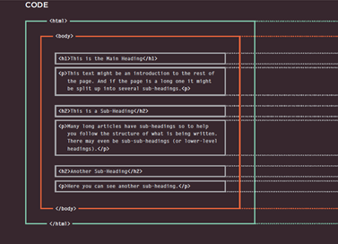

# HTML
## introduction

### How People Access the Web:
#### Browsers
People access websites using software called a web browser.
#### Web Servers
When you ask your browser for a web page, the request is sent across the Internet to a special computer known as a web server which hosts the website.
#### Screen readers
Screen readers are programs that read out the contents of a computer screen to a user. They are commonly used by people with visual impairments.

### How Websites Are Created:
#### How it is Created
Small websites are often written just using HTML and CSS.
Larger websites — in particular those that are updated regularly and use a content management system (CMS), blogging tools, or e-commerce software — often make use of more complex technologies on the web server, but these technologies are actually used to produce HTML and CSS that is then sent to the browser. So, if your site uses these technologies, you will be able to use your new HTML and CSS knowledge to take more control over how your site looks.

#### How the Web Works:
When you visit a website, the web server hosting that site could be anywhere in the world. In order for you to find the location of the web server, your browser will first connect to a Domain Name System (DNS) server.

## Structure
#### HTML Uses Elements to Describe the Structure of Pages

Tags act like containers.They tell you something about the information that lies between their opening and closing tags.

The opening <\ html \> tag indicates that anything between it and a closing </html> tag is HTML code