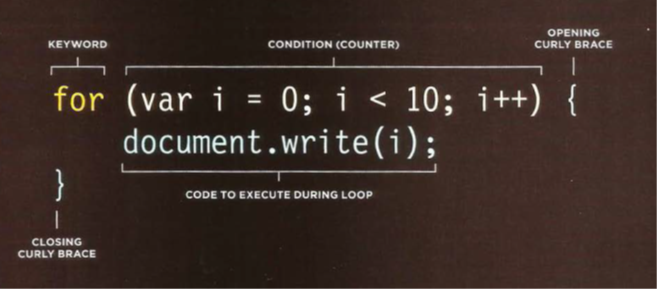
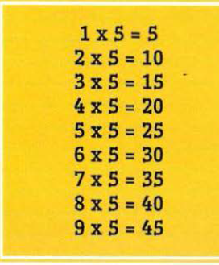

# LOGICAL OPERATORS

Comparison operators usually return single value of TRUE or FALSE. logical operators you to compare the results of more than one comparison operator.

## && LOGICAL AND:
This operator tests more than one condition.

| boolean | boolean |result|
| ---  | --- | ---|
| true |true |true |
| true |false |false |
| false |true |false |
| false |false |false |

## || LOGICAL OR:
This operator tests at least one condition.

| boolean | boolean |result|
| ---  | --- | ---|
| true |true |true |
| true |false |true |
| false |true |true |
| false |false |false |

## ! LOGICAL NOT:
This operator takes a single Boolean value and invert it.
 
| boolean | result|
| ---  | ---|
| !true |false |
| !false |true |

# LOOPS:
Check a condition. If it returns true, a code block will run. Then the condition will be checked again and if it still returns true , the code block will run again .it repeats until the condition false.
 
This is a for loop. the condition is a counter that count to ten. The result would write 0123456789 to the page. 

If the variable (i)is less than ten, the code inside the curly braces is executed. Then counter is incremented.

## KEY LOOP CONCEPTS

### break
This keyword causes the termination of the loop and tells the interpreter to go onto the next statement of code outside.
of the loop. (You may also see it used in functions.)
### continue
This keyword tells the interpreter to continue with the current iteration, and then check the
condition again. (If it is true, the code runs again.)

## USING WHILE LOOPS
This loop will continue to run for as long as the condition in the parentheses is true. That
condition is a counter indicating that, as long as the variable i remains less than 10, the
statements in the subsequent code block should run.
 
The result will be:
 
When the loop has finished, the interpreter goes to the next line of code.

