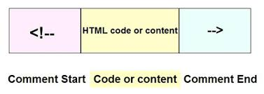

# Extra Markup

## How to add comment in html code:
will not be visible in the user's browser, you can add the text between these characters:
<!-- comment goes here -->

## ID Attribute
Every HTML element can carry the id attribute. It is used to uniquely identify that element from other elements on the page.

## Class Attribute
Every HTML element can also carry a class attribute. Sometimes, rather than uniquely identifying one element within a document, you will want a way to identify several elements as being different from the other elements on the page.

## Block Elements
Some elements will always appear to start on a new line in the browser window. These are known as block level elements.
Examples of block elements are h1, p, ul, and li.

## Inline Elements
Some elements will always appear to continue on the same line as their neighboring elements. These are known as inline elements. Examples of inline elements are a, b, em, and img.

#Grouping Text & Elements In a Block
The div element allows you to group a set of elements together in one block-level box.

## Grouping Text &Elements Inline
The span element acts like an inline equivalent of the div element. It is used to either:
1. Contain a section of text where there is no other suitable element to differentiate it from its surrounding text
2. Contain a number of inline elements.

## Iframes
An iframe is like a little window that has been cut into your page — and in that window you can see another page. The term iframe is an abbreviation of inline frame.

# HTML5 Layout

## Headers & Footers
The header and footer elements can be used for:
●● The main header or footer that appears at the top or bottom of every page on the site.
●● A header or footer for an individual article or section within the page.

## Navigation
The nav element is used to contain the major navigational blocks on the site such as the primary site navigation.

## Articles
The article element acts as a container for any section of a page that could stand alone and potentially be syndicated.

## ASIDE
The aside element has two purposes, depending on whether it is inside an article element or not.

## Sections
The section element groups related content together, and typically each section would have its own heading.

## Heading Groups
The purpose of the hgroup element is to group together a set of one or more h1 through h6 elements so that they are treated as one single heading.

## Figures
It can be used to contain any content that is referenced from the main flow of an article (not just images).
